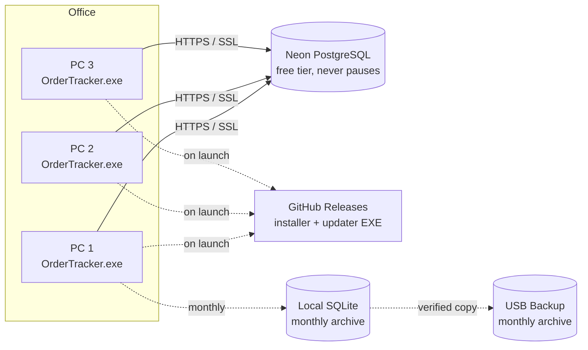
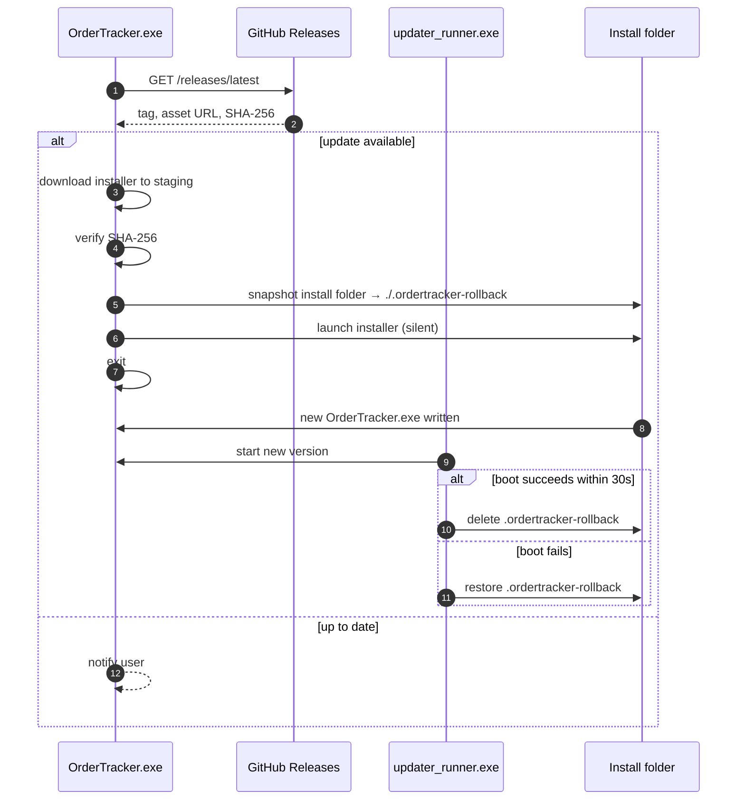
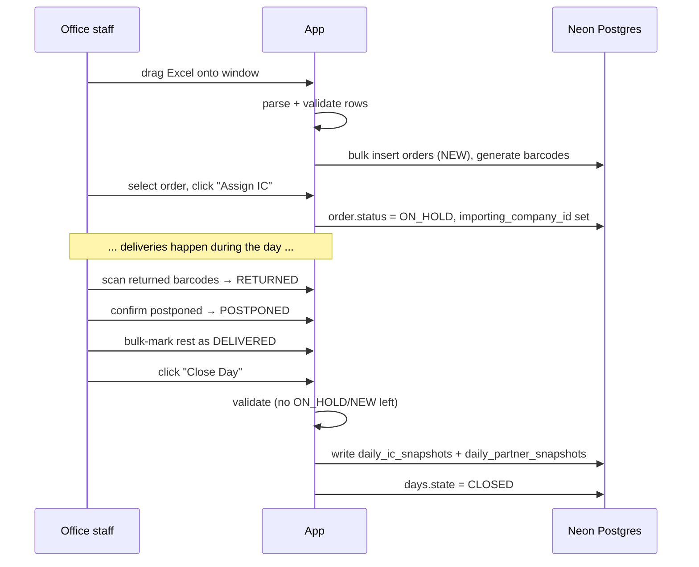
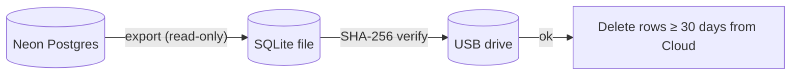

# Architecture

OrderTracker is a thick-client desktop application that talks to a single
shared **Neon PostgreSQL** database. Multiple PCs (2–3 office machines)
connect to the same database concurrently. There is no API tier — the client
is the application; the database is the source of truth.

## High-level deployment



## Process model on a single PC

```
┌──────────────────────────────────────────┐
│ OrderTracker.exe (Qt event loop)          │
│  ├─ UI: PyQt6 widgets + qss styles        │
│  ├─ Services: pure Python (no Qt deps)    │
│  ├─ SQLAlchemy 2.x + connection pool      │
│  └─ keyring + Fernet (encrypted DB URL)   │
└──────────────────────────────────────────┘
              │ launches
              ▼
┌──────────────────────────────────────────┐
│ updater_runner.exe (only during updates) │
│  ├─ Monitors new install                  │
│  └─ Restores .ordertracker-rollback/     │
│     if startup fails within 30s           │
└──────────────────────────────────────────┘
```

## Layered code structure

```
┌───────────────────────────────────────────────────────┐
│  Presentation layer (PyQt6)                           │
│  src/ordertracker/ui/                                 │
│   ├── main_window.py        — sidebar + stack         │
│   ├── login_window.py       — login dialog            │
│   └── views/                — one widget per screen   │
└───────────────────────────────────────────────────────┘
                           │
                           ▼
┌───────────────────────────────────────────────────────┐
│  Service layer (no UI imports here)                   │
│  src/ordertracker/services/                           │
│   ├── auth.py        ├── orders.py    ├── days.py     │
│   ├── companies.py   ├── partners.py  ├── audit.py    │
│   ├── profit.py      ├── archive.py   ├── barcode.py  │
│   ├── excel_import.py                ├── order_key.py │
└───────────────────────────────────────────────────────┘
                           │
                           ▼
┌───────────────────────────────────────────────────────┐
│  Data layer (SQLAlchemy 2.x)                          │
│  src/ordertracker/db/                                 │
│   ├── models.py             ├── session.py            │
│   └── base.py                                         │
└───────────────────────────────────────────────────────┘
                           │
                           ▼
                  ┌──────────────────┐
                  │  Neon Postgres   │
                  └──────────────────┘
```

## Concurrency

Two PCs may edit the same order simultaneously. We use **optimistic locking**:

1. The `Order` row has an `updated_at` timestamp that the DB updates on every
   write.
2. The UI loads the row and remembers `updated_at` at that moment.
3. On save the service compares the stored value against the in-memory one.
4. If they differ → `ConcurrentEditError` is raised and the UI tells the user
   to refresh.

This avoids row-level DB locks (which would not work across Neon's
connection pooler anyway).

## Sessions and security

| Concern | Solution |
| --- | --- |
| Password storage | `bcrypt` (cost 12) |
| Login throttling | 5 failed attempts → 5-minute lock; counter resets on success |
| Session timeout | 30 minutes of UI inactivity → forced logout |
| Connection string | Encrypted with Fernet, key stored in OS keyring |
| TLS | Neon enforces SSL on every connection |
| Audit log | Append-only; no DELETE rights granted to the role used by the app |

## Update flow



## Daily order lifecycle



## Archiving flow



If any step fails, the cloud rows are **not** deleted.
