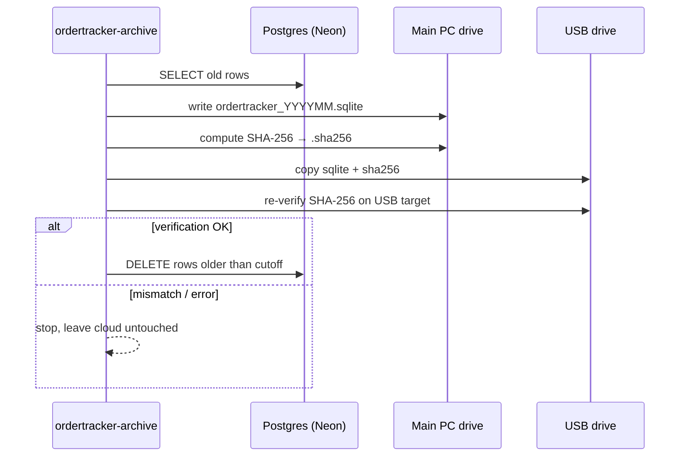

# Archiving strategy

OrderTracker keeps the live cloud database lean by exporting old data into a
local SQLite archive once a month. This is a three-phase operation so a
half-finished archive can never lose data.

## Trigger

End of each month (cron or manual). Default cutoff is
[`ARCHIVE_OLDER_THAN_DAYS`](../src/ordertracker/constants.py) — 30 days.

## Phases

Phases match three functions in
[`services/archive.py`](../src/ordertracker/services/archive.py):

| Function | Purpose |
| --- | --- |
| `export_archive()` | Phase 1 — read-only export to SQLite |
| `copy_to_usb()` | Phase 2 — copy + SHA-256 verify on USB |
| `prune_cloud()` | Phase 3 — DELETE old rows; requires a verified USB copy |

## Tables archived

* `orders`
* `days`
* `daily_partner_shares`
* `daily_ic_snapshots`
* `daily_partner_snapshots`
* `audit_logs` (timestamps before cutoff)

Reference data (`users`, `partners`, `production_companies`,
`importing_companies`) is **not** archived — those rows are still in active
use even months later.

## Restore

The archive SQLite file can be opened read-only by any standard SQLite
viewer (e.g. DB Browser for SQLite). Each row contains the same columns as
the original Postgres tables, stringified.

A future "Archive viewer" tab can be added to load the SQLite into a
read-only `sqlite:///…` engine, but the data is already accessible without
any tooling beyond standard SQLite clients.

## Retention

Archive files older than [`ARCHIVE_RETENTION_YEARS`](../src/ordertracker/constants.py)
(3 years by default) are candidates for cold storage — the CLI does not
delete them automatically.
