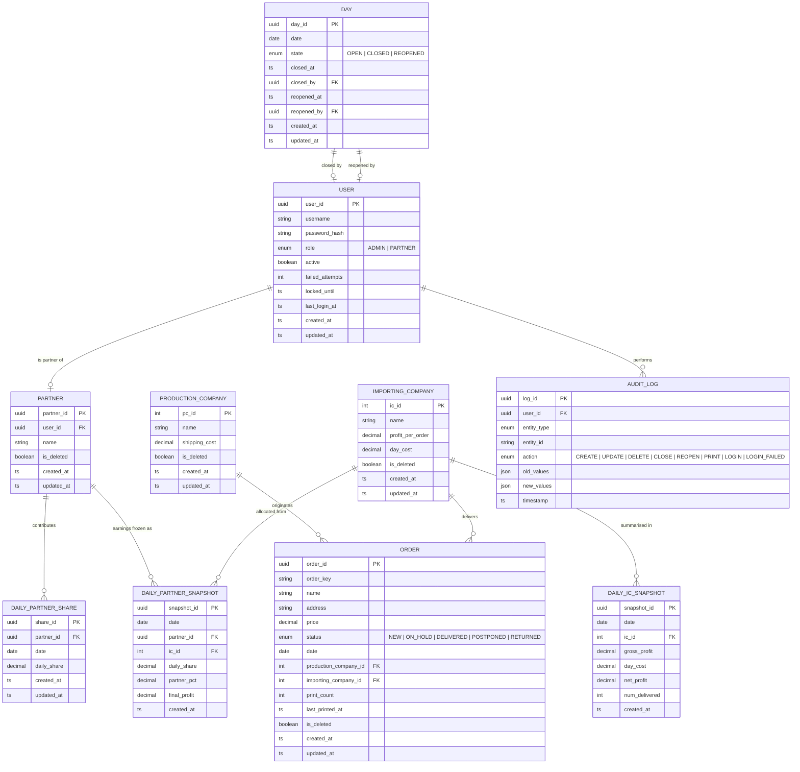

# Entity–Relationship Diagram

## Relationship cardinalities at a glance

| From | → | To | Cardinality | Notes |
| --- | --- | --- | --- | --- |
| `users` | one-to-zero/one | `partners` | 1 ⇒ 0..1 | only PARTNER role users have a row |
| `production_companies` | one-to-many | `orders` | 1 ⇒ N | enforced by `RESTRICT` FK |
| `importing_companies` | one-to-many | `orders` | 1 ⇒ N (nullable) | NEW orders have no IC yet |
| `partners` | one-to-many | `daily_partner_shares` | 1 ⇒ N | unique on (partner, date) |
| `days` | one-to-zero/one | `users` (closed_by) | 1 ⇒ 0..1 | nullable until closed |
| `daily_ic_snapshots` | one row per | (date, ic_id) | UNIQUE | immutable |
| `daily_partner_snapshots` | one row per | (date, partner, ic) | UNIQUE | immutable |
| `audit_logs` | many-from | `users` | N ⇒ 1 | nullable for system actions |
