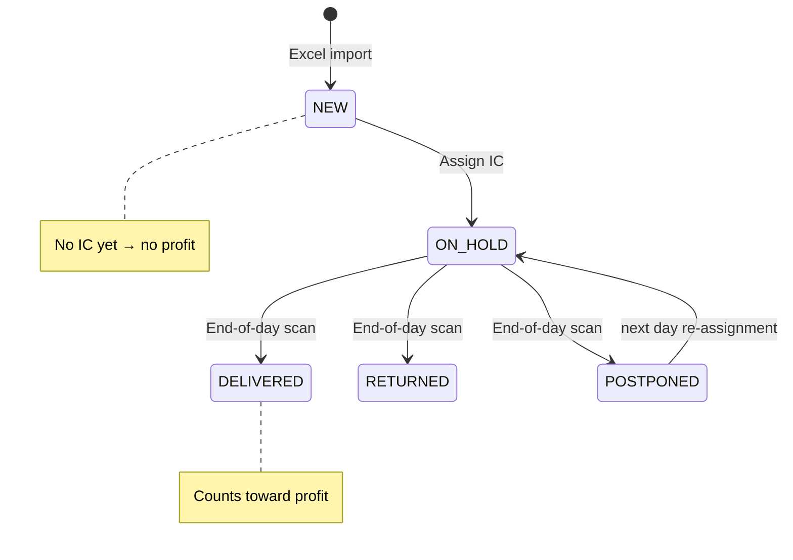
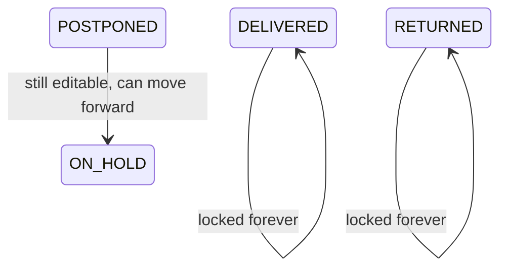
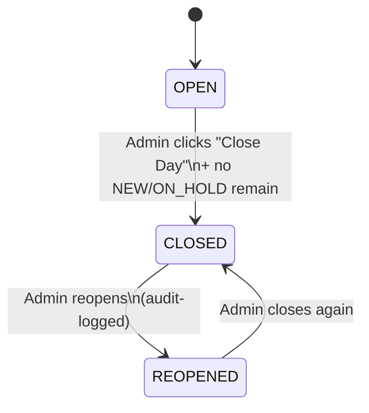

# Order & day state machines

## Order status (open day)



## Order status (closed day)



## Day state



## Transition matrix (machine-readable)

These are the same maps used at runtime by
[`services.orders.OrderService.transition`](../src/ordertracker/services/orders.py):

```python
ALLOWED_TRANSITIONS_OPEN_DAY = {
    NEW:        {ON_HOLD},
    ON_HOLD:    {DELIVERED, RETURNED, POSTPONED},
    POSTPONED:  {ON_HOLD},
    DELIVERED:  {RETURNED, ON_HOLD, POSTPONED},
    RETURNED:   {DELIVERED, ON_HOLD, POSTPONED},
}

ALLOWED_TRANSITIONS_CLOSED_DAY = {
    POSTPONED:  {ON_HOLD},
}
```

## Invariants

| Invariant | Enforced by |
| --- | --- |
| `num_orders == delivered + returned + postponed + on_hold` (per company per day) | `CompanyDailyStats.assert_balanced` |
| Cannot close a day with `NEW`/`ON_HOLD` orders | `DayService.close` |
| Closed-day `DELIVERED`/`RETURNED` orders cannot be edited | `services.orders` + transition matrix |
| Concurrent edits raise an error rather than overwrite | `services.orders._load_for_update` |
| Snapshots are append-only | UNIQUE indexes + service code never UPDATEs |
| Audit log is append-only | DB role lacks DELETE permission |
